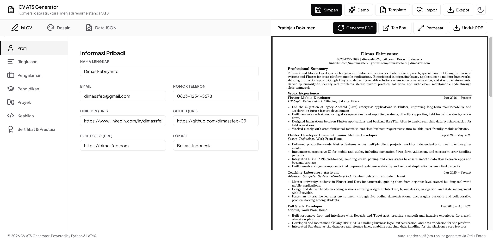

# CV ATS Generator

Alat otomatis berbasis Python dan LaTeX untuk menghasilkan CV profesional berstandar ATS (Applicant Tracking System) dari data JSON. Dilengkapi dengan antarmuka web interaktif untuk mempermudah penyuntingan secara real-time.



## 🚀 Fitur Utama
- **Real-Time Web Editor**: Edit CV kamu secara visual melalui form interaktif atau teks JSON mentah.
- **Auto-Render & Preview**: PDF diperbarui secara real-time di panel pratinjau dalam waktu 1.2 detik setelah kamu selesai mengetik/mengubah desain.
- **Save to Disk**: Tombol **Simpan** untuk menyimpan data CV Anda langsung ke server (`data/cv_data.json`) dengan proteksi validasi skema otomatis.
- **Desain Adaptif**: Ubah ukuran font, jenis font (Latin Modern, Charter, Utopia, Palatino), margin, dan line spacing langsung dari pengaturan desain.
- **Nested Bullets**: Struktur bullet bertingkat yang rapi untuk detail pencapaian proyek dan pengalaman kerja.
- **JSON Schema Validation**: Mencegah salah ketik data dengan sistem pengecekan otomatis berbasis skema JSON.

## 🛠 Prasyarat
Sebelum menggunakan aplikasi ini, pastikan kamu sudah menginstall:
1. **Python 3.x**
2. **MiKTeX** atau **TeX Live** (untuk menjalankan `pdflatex`). Pastikan `pdflatex` sudah ada di PATH terminal kamu.

> [!TIP]
> **Tidak ingin menginstall LaTeX secara lokal?** Anda dapat menggunakan **Docker** (untuk lokal) atau **GitHub Actions** (untuk cloud) yang telah dikonfigurasi dalam repositori ini agar kompilasi dilakukan secara otomatis di container/cloud tanpa instalasi LaTeX di sistem Anda (baca panduannya di bawah).

## 📥 Instalasi

1. **Clone Repository**
   ```bash
   git clone https://github.com/dimassfeb-09/cv-ats-generator.git
   cd cv-ats-generator
   ```

2. **Install Dependensi Python**
   ```bash
   pip install -r requirements.txt
   ```

## 🖥️ Cara Penggunaan

### Mode 1: Antarmuka Web (Rekomendasi)
Jalankan server lokal FastAPI untuk membuka editor visual di peramban (browser) Anda:
```bash
python app.py
```
Atau menggunakan uvicorn langsung:
```bash
uvicorn app:app --reload
```
Setelah server aktif, buka **[http://127.0.0.1:8000](http://127.0.0.1:8000)** di browser Anda.
* **Sunting**: Isi form di sidebar (Profil, Pengalaman, Desain, dsb.) atau manipulasi JSON langsung di tab **Data JSON**.
* **Simpan**: Klik tombol **Simpan** di pojok kanan atas untuk menyimpan perubahan secara permanen ke file `data/cv_data.json` Anda.

---

### Mode 2: CLI / Script Lokal (Kompilasi Manual)

1. **Menyiapkan Data**
   Salin berkas data contoh jika belum memilikinya:
   ```bash
   cp data/cv_data.example.json data/cv_data.json
   ```
   Edit berkas `data/cv_data.json` menggunakan text editor favorit Anda.

2. **Kompilasi Manual**
   Jalankan script generator untuk merender berkas PDF secara manual:
   ```bash
   python generator.py
   ```
   File hasil jadi PDF akan dibuat di `output/cv_output.pdf`.

3. **Auto-Builder CLI**
   Jika ingin PDF terkompilasi ulang secara otomatis di terminal setiap kali Anda menyimpan file JSON di text editor:
   ```bash
   python watch_build.py
   ```

---

## 🐳 Opsi Alternatif (Tanpa Install LaTeX Secara Lokal)

Jika Anda tidak ingin mengunduh software LaTeX (MiKTeX/TeX Live) yang berukuran cukup besar di komputer lokal Anda, ada 2 opsi alternatif:

### Opsi A: Menggunakan Docker (Rekomendasi Local Setup)
Aplikasi ini sudah dilengkapi dengan `Dockerfile` yang memaketkan Python dan instalasi LaTeX minimal secara otomatis.

1. **Build Docker Image**
   ```bash
   docker build -t cv-ats-generator .
   ```
2. **Jalankan Container**
   ```bash
   docker run -p 8000:8000 cv-ats-generator
   ```
3. Buka **[http://127.0.0.1:8000](http://127.0.0.1:8000)** di browser Anda. Seluruh proses compile akan berjalan di dalam container.

### Opsi B: Kompilasi Otomatis via GitHub Actions (Rekomendasi Cloud Setup)
Repositori ini telah dikonfigurasi dengan workflow CI/CD GitHub Actions (`.github/workflows/compile-pdf.yml`).

1. Edit data CV Anda (`data/cv_data.json`) langsung di repositori GitHub Anda (atau edit secara lokal dan lakukan `git push`).
2. Setiap kali ada perubahan di file data JSON atau template LaTeX yang di-push, GitHub Actions akan **otomatis mengompilasi PDF** Anda di server GitHub.
3. Tunggu sekitar 1 menit, hasil jadi PDF terbaru akan di-commit kembali oleh bot ke folder `output/cv_output.pdf` di repositori Anda. Anda tinggal mengunduh berkasnya dari GitHub!

---

## 📂 Struktur Proyek
- `app.py`: Backend FastAPI untuk melayani antarmuka web dan API simpan/kompilasi.
- `frontend/`: File frontend (HTML, CSS, JS) untuk editor visual.
- `data/`: Berisi data CV (`cv_data.json`) dan skema validasi (`cv_schema.json`).
- `templates/`: Template desain CV dalam format LaTeX (`cv_template.tex.j2`).
- `output/`: Lokasi hasil jadi PDF dan file sementara LaTeX.
- `generator.py`: Script utama untuk merender template dan kompilasi PDF.
- `watch_build.py`: Script pemantau perubahan file JSON lokal untuk auto-build CLI.

## 📄 Lisensi
Proyek ini dibuat untuk penggunaan pribadi dan profesional. Silakan dikembangkan lebih lanjut!
